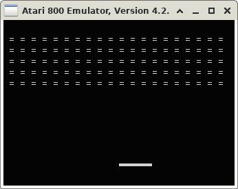

# A clone of Arkanoid for Atari XL/XE
My clone of Arkanoid for Atari XL/XE written in CC65.



### Setting up the programming environment

```sh
$ sudo apt update
```
(Update the package lists)

```sh
$ sudo apt install cc65
```
(Install the CC65 cross-compiler for 6502 to compile the source code files)

```sh
$ sudo apt install atari800
```
(Install the Atari emulator to run, test and play your favorite game)

### Building the game from source code

```sh
$ make
```

### Running the game on the Atari emulator

```sh
$ make run
```

### License
[GPLv3](http://www.gnu.org/licenses/gpl.html)
